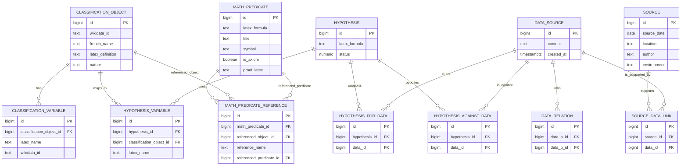

# ER Diagram

## Notes

- `DATA_RELATION` stores links between data items.
- `SOURCE_DATA_LINK` links a source to the data it supports.
- `HYPOTHESIS_FOR_DATA` and `HYPOTHESIS_AGAINST_DATA` store the relationship between hypotheses and data.
- `MATH_PREDICATE_REFERENCE` stores references used in proofs and formulas.
